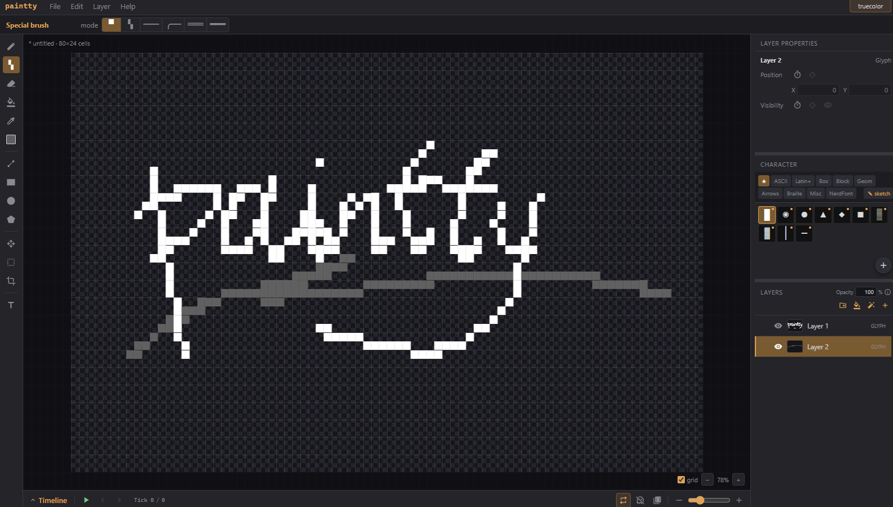
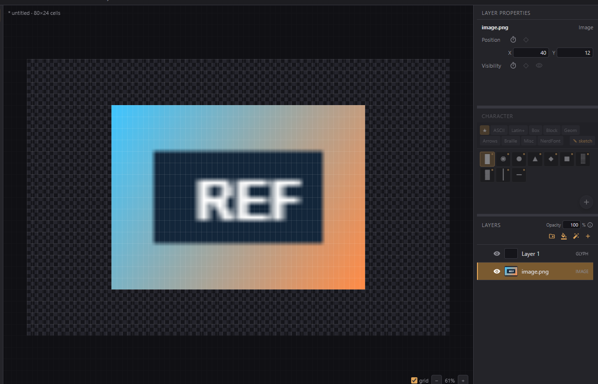
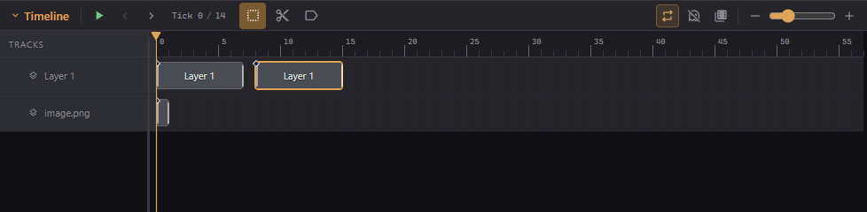

# Paintty

Paintty is a browser-based editor for terminal art and animations. It supports
Nerd Fonts, truecolor, and background colors. It includes many useful tools and
powerful workflows for creation. Try it at <https://paintty.hendryhu.com/>.

Tested on Chromium.



## What you can do

- Draw, fill, erase, select, transform, move, crop, pan, and zoom.
- Work with independent glyph/foreground and background channels.
- Create editable text, lines, rectangles, circles, and polygons.
- Organize glyph, background, text, shape, image, video, effect, and group layers.
- Apply brightness, contrast, saturation, and hue effects with optional masks.
- Import images and videos as references, then convert them into terminal cells.
- Paste reference images directly from the clipboard.
- Import audio and arrange clips on the timeline.
- Animate clips, frames, positions, visibility, effects, masks, text, and shapes.
- Add loop markers, programmer events, onion skin, and filmstrips.
- Preview output in truecolor or a nearest-256-color terminal palette.



## Animation

Extend a layer's clip, move to another tick, and edit to create animation. The
timeline supports selection, razor cuts, tags, audio tracks, property keys,
thumbnail views, looping, and playback.



Press `K` to play or stop. Use Left and Right to move one tick at a time.

## Projects and output

Paintty projects are saved as a single `.paintty` file containing the editable
project and its imported media, similar to a PSD. Automatic file recovery is
available after an interrupted session.

Current artwork can be exported as plain text, ANSI, shell commands, PNG, or
JPG. Complete animations can be exported as MP4 or as an Animation JSON/ZIP for
games and other programs.

## Live terminal preview

Open `File > CLI Preview` to visit the paintty-cli GitHub Releases page. Download
the Windows or Linux binary there. On Windows, double-click the EXE. On Linux,
run `chmod +x paintty-cli-linux-x86_64` once for each downloaded binary, then run
`./paintty-cli-linux-x86_64 <folder>`. In Chrome or Edge, choose
`File > Watch folder...` and open the same folder in the CLI to follow Paintty's
artwork and playhead in a real terminal.

## Useful shortcuts

| Shortcut | Action |
| --- | --- |
| `Ctrl/Cmd+S` | Save |
| `Ctrl/Cmd+Z` | Undo |
| `Ctrl/Cmd+Y` or `Ctrl/Cmd+Shift+Z` | Redo |
| `Ctrl/Cmd+C` / `Ctrl/Cmd+V` | Copy / paste active layer clips or selected Timeline clips |
| `Shift+drag` a Timeline clip | Duplicate and move selected clips |
| `Ctrl/Cmd+T` | Transform selection or move layer |
| `K` | Play / stop |
| `Left` / `Right` | Previous / next tick |
| `F2` | Rename selected layer |
| `Space+drag` or middle-drag | Pan canvas |
| `Escape` | Cancel or close the frontmost action |

## Run locally

```sh
npm ci
npm run dev
```

Create a static production build with `npm run build`.
